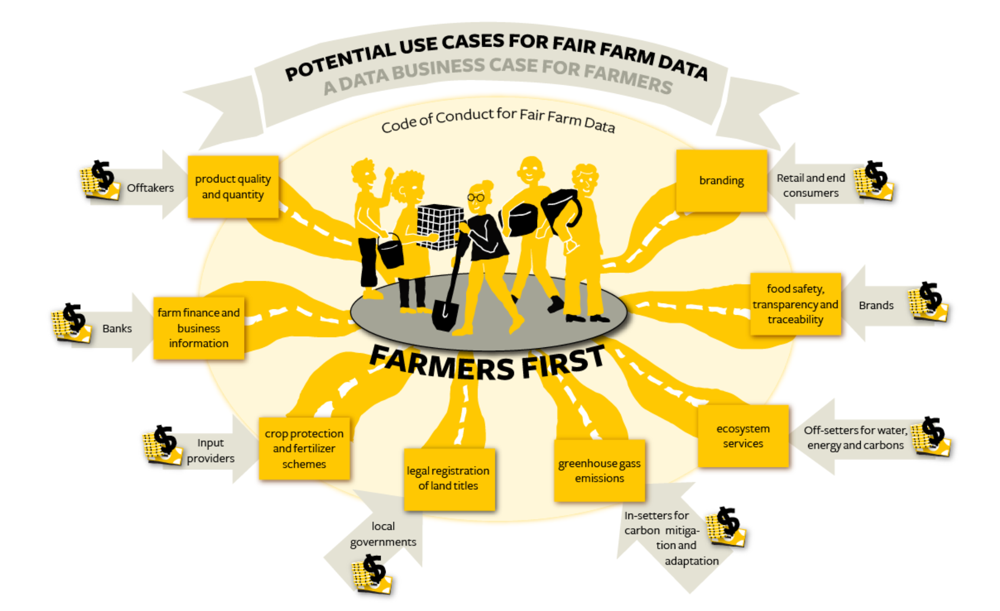

# Argriculture one pager

## Introduction
Argriculture in Tanzania represents x % of the GDP and involves y% of the total population.  The current state is still very traditional and does not include (much) modern farming tools and technologies.  To increase the returnn in the agricultural sector DATA is a very importantant commodity that can enhance the sectors success and get the sector into the 22 century.

## Data is a transformative commodity

With the increasing importance of data, a new global supply chain arises. Farmers in the future will not just farm their food products, but will become data farmers as well. In an ecosystem where many stakeholders benefit from the joint use of the data, data owned by well-connected farmers, can help them to increase yields and income. It helps them to grow the right crops, in the right way and with a better connection to markets, information, finance and agri inputs and services.

To make sure the data economy works for farmers, ethical principles and practical solutions are necessary. We feel there should be a global charter for the use of data from smallholder farmers. Fair Farmer Data reflects our vision beyond fair trade, but then for data. So what is fair data?

Faird Data is based on the principles of Fair Participation, Fair Ownership, Fair Value and Fair Voice in the entire value chain.

Fair Data is founded on two key principles:
- Farmers remain in control of their own data (Fair Ownership)
- The value of the data returns to the farmer on three levels:
  - Digital Inclusion (Fair Voice)
  - Access to services (Fair Participation)
  - Rewards and incentives (Fair Value)

Data directs the pathway for a data economy that works for smallholder farmers. And leverages digital smallholder farmer inclusion and sector wide interoperability frameworks towards seamless exchange of data whilst generating value for the farmer.

Over the past decade, systemic transformations characterized by a new dependency upon data driven insights and access to digital opportunities, have brought radical transformations to (agricultural) production systems and processes worldwide. Technology has become a great enabler in the field of food and agriculture.

The added value of digital technology to support improving livelihoods while contributing to sustainability objectives is clear. The huge potential to increase efficiency in the scalability of interventions is also non-disputable. Further uptake of digital tools will give farmers access to knowledge to improve practices and yields and to financial services and markets. Over the last 10 years the agritech landscape expanded dramatically. Many new entrants and start-ups developed solutions and applications targeting smallholder farming in the global South. The possibilities of the internet of things and precision farming for smallholders are promising. Blockchain technology to secure transparency of data and information exchange and tokenization has the potential to improve supply chain efficiency and contribute to a better share of value, improving farmers' livelihoods.

# Farmers First

